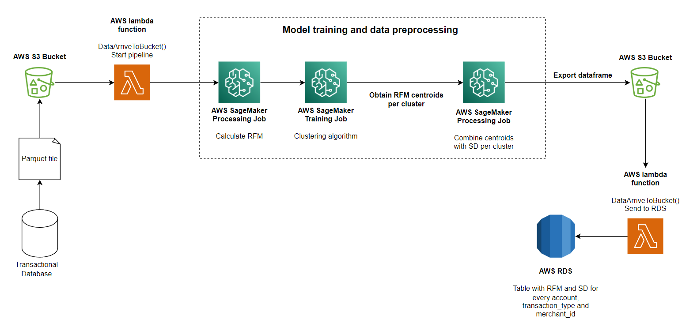

# Prueba tecnica NEQUI - Científico de datos

Este repositorio contiene el código del modelo que busca encontrar transacciones atípicas por su frecuencia.

**El modelo consiste de un calculo de RFM por cuenta, clusterización de cuentas con RFM similares, comparación de transacción nueva con los centroides del cluster y toma de decisiones basada en los Z-Score.**

## Arquitectura propuesta para el modelo

A continuación se muestra una imagen de la arquitectura que se propone para la puesta en producción del modelo utilizando componentes de AWS.

Notemos que al final, el resultado se guarda en una base de datos relacional puesto que nuestro modelo no arroja una función que permite clasificar sino que deja una tabla que nos sirve para hacer comparaciones.

## ¿Cada cuanto re-entrenar el modelo?

Segun la información suministrada en el conjunto de datos, en promedio al dia se hacen 64.421 transacciones, lo que corresponde a unas 450.947 semanales. Si tenemos en cuenta que se esta trabajando unicamente con una muestra, el numero de transacciones es aun mas grande.

Con tanta información disponible, posibles patrones de comportamiente cambiantes para los clientes y un algoritmo que no requiere mucho poder de computo, calcular nuevamente los valores de RFM y hacer la clusterización para cada grupo de cuentas puede ser realizado **cada semana en horarios nocturnos y en dias de poco flujo transaccional, para asi no afectar otros procesos.**